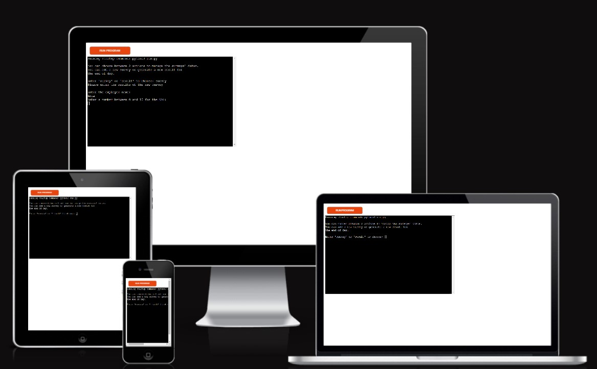

# Survey Data Tracker

This program is made for a Team Leader (TL) to track the result of his Customer Service Team. 
Every company wants to offer quality of service in which the Team Leaders are directly involved.
It will be a good tool to keep track of the progression of the its Team and build a historic. The TL will be able to see the score for 2 different metrics and take the necessary actions depending of the results.

Project URL: [Survey_data App](https://survey-data-5ea6d17d5157.herokuapp.com/) & [Survey_data Sheet](https://docs.google.com/spreadsheets/d/1a8VDfNuTW4TsZ5a3a3hQsSJ9Aytg_5V-BCbl-jg-ytw/edit#gid=0)

## Features

### Initial action

### Survey sheet

### Score sheet

### Future features

## Testing

### Manual Testing

### Validator Testing

### Fixed issues

## Deployment

* **Clone project**:

This project will be also cloned to work locally on the future realesed by following these setps:

Go in General Knowledge Quizz repository,
Click on Code to find the URL and copy it.
In the Terminal write git clone and paste the url.
Press Enter to create the clone.

## Credits