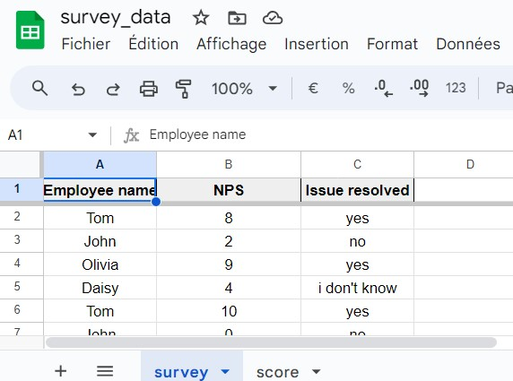

# Survey Data Tracker

This program is made for a Team Leader (TL) to track the result of his Customer Service Team. 
Every company wants to offer quality of service in which the Team Leaders are directly involved.

It will be a good tool to keep track of the progression of the its Team and build a historic. The TL will be able to see the score for 2 different metrics and take the necessary actions depending of the results.

Project URL: [Survey_data App](https://survey-data-5ea6d17d5157.herokuapp.com/) & [Survey_data Sheet](https://docs.google.com/spreadsheets/d/1a8VDfNuTW4TsZ5a3a3hQsSJ9Aytg_5V-BCbl-jg-ytw/edit#gid=0)

## Features

The program will be used once at the end of the day to enter the new survey and get the average score of the NPS (*Net Promoter Score*) and the resolution persentage of the Team. It is storing the datas on Google Sheets thanks to [gspread](https://docs.gspread.org/en/v5.10.0/) and [Google Auth Library for Python](google.oauth2.service_account).

### Initial action

When starting the program, the user will choose between two actions: add survey in the survey sheet and generate the result in the score sheet. During this two processes, the datas are checked and validated.

1. **Survey choice**:

Once a day, the users will be able to enter as many survey as received. Three datas will be asked : the name of the agent/employee who received the survey, the NPS score that the customer gave and what the customer answered to the question "*Is your issue resolve?*".

The NPS is important for Customer Service departments and a company while checking the quality of service offered. It is a way of measuring customer satisfaction. The goal is to avoid detractor who are customer that will not recommend the brand and impact the business growth.

To track the quality of the customer service, it is also important to identify if the Team members was able to help the customer. This is why the resolution is tracked too.

As seen below, once the three datas of a survey are entered, the user will either be able to enter a new survey or get the result.

2. **Result choice**:

When the user will have entered in the program all the datas of the surveys received during the day, the user will need to generate the result of the day by writing 'result' to exit the loop.

The program will then calculate the average NPS score and the resolution percentage of the Team from the survey sheet. The date of this calculation will be render using [datetime](https://docs.python.org/3/library/datetime.html).
Depending on the result, the program will request the TL  to take action. Another message will appear confirming that the score sheet has been updated. Then it will prompt the TL to check the details in the score sheet.

Finally, an end message and a reminder message will be shown.

### Survey sheet

When the user choose to the "survey choice", the data are sent in this sheet. The survey sheet is divided in 3 columns:
* Employee name: name of the employee who receive the survey.
* NPS: to store the customer satisfaction as seen earlier.
* Issue resolved: to store the resolution answer from the customer.

All of this datas will be used to calculate the Team result in the score sheet.

### Score sheet

Once the user finished to enter all the survey of the day and select the "result choice", the score sheet will be updated. The Team Leader will be able to see the evolution of the Team and see where the opportunities for improvement are depending on the targets set. Indeed the sheet is divided in 4 columns which indicate: 
* Date: the date when the calculations were done after all survey were provided.
* Average NPS: the average NPS from all the NPS surveys in the survey sheet.
* % Issue resolved: the calculation of the percentage of issue resolved in the survey sheet.
* Action: the actions highly recommended to the Team Leader to improve his Team results. 

### Future features

A new feature will be added for the moderator and Team Leader to get the result of a specific date. It will be done by using [datetime](https://docs.python.org/3/library/datetime.html).

## Testing

### Manual Testing

| Test | Expected result | Passed |
|----|-------|---|      
|Google Sheets connection|The program is connect and interacts with the Survey_data sheet| YES |
|Heroku Testing|The program is running on a Heroku App| YES |
|Program Kick-off|The program starts with initial print statements and initial input| YES |
|Initial input|Only 2 inputs are accepted thanks to validator: 'survey' and 'result'| YES|
|Initial Validator|The validator is looping until user enter a valid initial input| YES |
|Name input|In 'survey' option, the input is running and append to sheet after validation | YES |
|NPS input| In 'survey' option, the input is running and append to sheet after validation | YES |
|Resolution input| In 'survey' option, the input is running and append to sheet after validation | YES |
|Name Validator|The validator is looping until user enter a valid name as it only accepts alphabet letters| YES |
|NPS Validator|The validator is looping until user enter a valid number between 0 and 10| YES |
|Resolution Validator|The validator is looping until user enter a valid resolution answer : 'yes', 'no' and 'i don't know'| YES |
|Initial input restart|The initial input display again once the three datas survey are completed| YES |
|Result input| The input get and calculates the data then append them to score sheet after validation | YES |
|Date info| The program successfully get the date from [datetime](https://docs.python.org/3/library/datetime.html) | YES |
|NPS Average| The NPS is successfully calculate from the survey sheet| YES |
|Resolution %| The percentage of 'yes' in the survey sheet is successfully calculated| YES |
|Action result| The action column is successfully updated depending on the average NPS and resolution %| YES |
|Action message|The program ends with a message informing the user if an action is needed and a reminder for next day|

### Validator Testing

### Fixed issues

## Deployment

* **Clone project**:

This project will be also cloned to work locally on the future realesed by following these setps:

Go in General Knowledge Quizz repository,
Click on Code to find the URL and copy it.
In the Terminal write git clone and paste the url.
Press Enter to create the clone.

## Credits